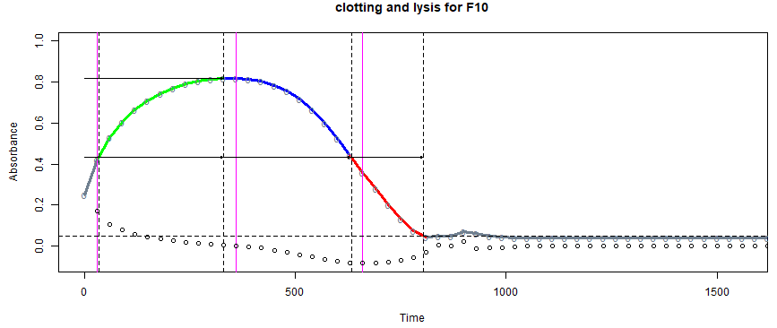
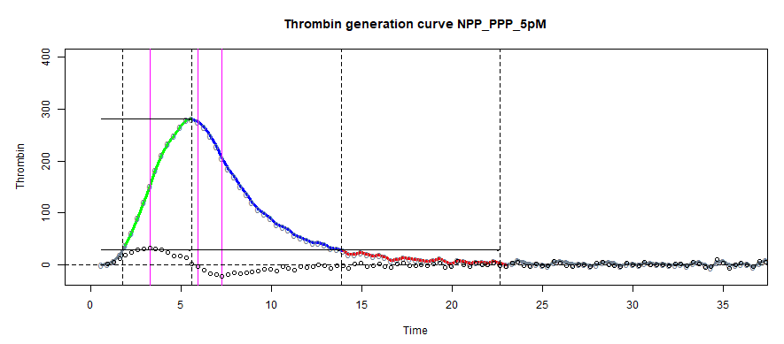

## Welcome to my GitHub Pages

### This site contains links to my Shiny apps that deal with biochemistry, particularly in relation to haemostasis and the clotting and lysis of fibrin.

### Table of contents

#### These are the apps available

* Clot <a href="#lysis">lysis</a> 

* Thrombin <a href="#generation">generation</a>

* Screening <a href="#tests">tests</a>

* Zymogen <a href="#activation">activation</a>

* Michaelis Menten <a href="#kinetics">kinetics</a>

* Binding curves and Scatchard <a href="#plots">plots</a>

* Fibrinolysis halo assasy <a href="#analysis">analysis</a>

* Prekallikrein activator in <a href="#albumin">albumin</a>

### Clot lysis

The first Shiny app I developed was designed to facilitate the analysis of fibrin clotting and lysis curves, such as the one shown below. 

 
	
This is a link to the online app, please try it out. [clotlysis_2019](https://drclongstaff.shinyapps.io/clotlysisCL_2019)

The output from a set of clot lysis curves is shown here, along with the results for the time to 50% clot lysis. The app makes it easy to extract selected parameters from these curves, such as time to a chosen % lysis, maximum absorbance, area under the curve, etc.

Options are provided for baseline selection and curve fitting to facilitate reproducible, high throughput analysis

Detailed help notes are available [here](./docs/Clotlysis_CL_help_notes_2019.pdf){:target="_blank"}

	
### Thrombin generation

 

Detailed help notes are available [here](./docs/TGA_help_notes_2019.pdf){:target="_blank"}

	
### Screening tests and false positives, for example with D-dimer assays

	
### Zymogen activation, for example plasminogen activation assays

	
Detailed help notes are available [here](./docs/TGA_help_notes_2019.pdf){:target="_blank"}

	
### Michaelis Menten kinetics and linear transformations

	
### Binding curves and Scatchard plots

	
### Fibrinolysis halo assays

	
### Prekallikrein activator contamination in albumin or immunoglobulins

