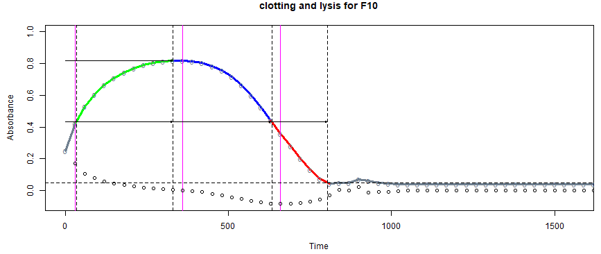
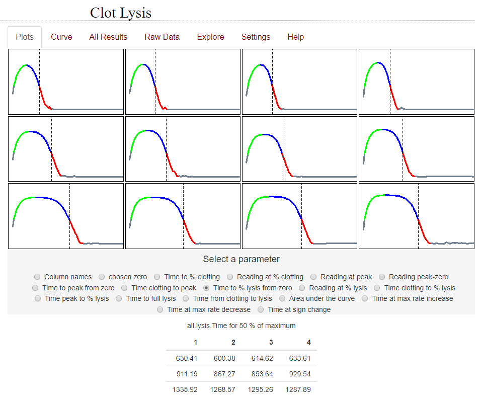

## Welcome to my GitHub Pages site

### This site contains links to my Shiny apps that deal with biochemistry, particularly in relation to heamostasis and the clotting and lysis of fibrin.

The first Shiny app I developed was designed to facilitate the analysis of clotting and lysis curves, such as the one shown below. 

 
	
This is a link to the online app [clotlysis_2019](https://drclongstaff.shinyapps.io/clotlysisCL_2019)

The output from a set of clot lysis curves is shown here, along with the results for the time to 50% clot lysis.



### Markdown

Markdown is a lightweight and easy-to-use syntax for styling your writing. It includes conventions for

```markdown
Syntax highlighted code block

# Header 1
## Header 2
### Header 3

- Bulleted
- List

1. Numbered
2. List

**Bold** and _Italic_ and `Code` text

[clotlysis_2019](https://drclongstaff.shinyapps.io/clotlysisCL_2019) and 
```

For more details see [GitHub Flavored Markdown](https://guides.github.com/features/mastering-markdown/).

### Jekyll Themes

Your Pages site will use the layout and styles from the Jekyll theme you have selected in your [repository settings](https://github.com/drclongstaff/shiny-clots/settings). The name of this theme is saved in the Jekyll `_config.yml` configuration file.

### Support or Contact

Having trouble with Pages? Check out our [documentation](https://help.github.com/categories/github-pages-basics/) or [contact support](https://github.com/contact) and we’ll help you sort it out.
