<link rel="stylesheet" type="text/css" href="stylesheet.css" />

## Welcome to my GitHub Pages

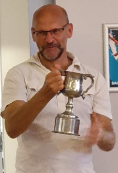

<a href = "mailto: drclongstaff@gmail.com">Contact me</a>

### This site contains links to my Shiny apps that deal with biochemical analysis, particularly in relation to haemostasis and the clotting and lysis of fibrin.

#### The apps are written using the Shiny package for R to help standardise methods and promote reproducible analysis.  Further details are published in the <A HREF = "https://onlinelibrary.wiley.com/doi/10.1111/jth.13656" TARGET="_blank">Journal of Thrombosis and Haemostasis</A>

#### Select a brief description of an app or follow the link to use the app online

<table>
		<tr> 
			<th>Brief description </th> 
			<th>Link to online app</th> 
			<th>Document links</th> 
			<th>YouTube </th> 
		</tr> 
		
		<tr> 	
			<td><a href="#lysis">Clot lysis</a></td> 
			<td><A HREF = "https://drclongstaff.shinyapps.io/clotlysisCL_2019" TARGET="_blank">ClotlysisCL_2019</A></td> 
			<td><A HREF = "./docs/Clotlysis-CL-help-notes-2019.pdf" >help notes</A>
			    <A HREF = "https://doi.org/10.1111/jth.14787" TARGET="_blank">publication</A></td>	
			<td><A HREF = "https://youtu.be/GCP6sgw10gE" TARGET="_blank" >Video</A></td>
		</tr>  
</table>

### Clot lysis

This app was designed to facilitate the analysis of fibrin clotting and lysis curves. 

The output from a set of clot lysis curves is shown here, along with the results for the time to 50% clot lysis. The app makes it easy to extract selected parameters from these curves, such as time to a chosen % lysis, maximum absorbance, area under the curve, etc.

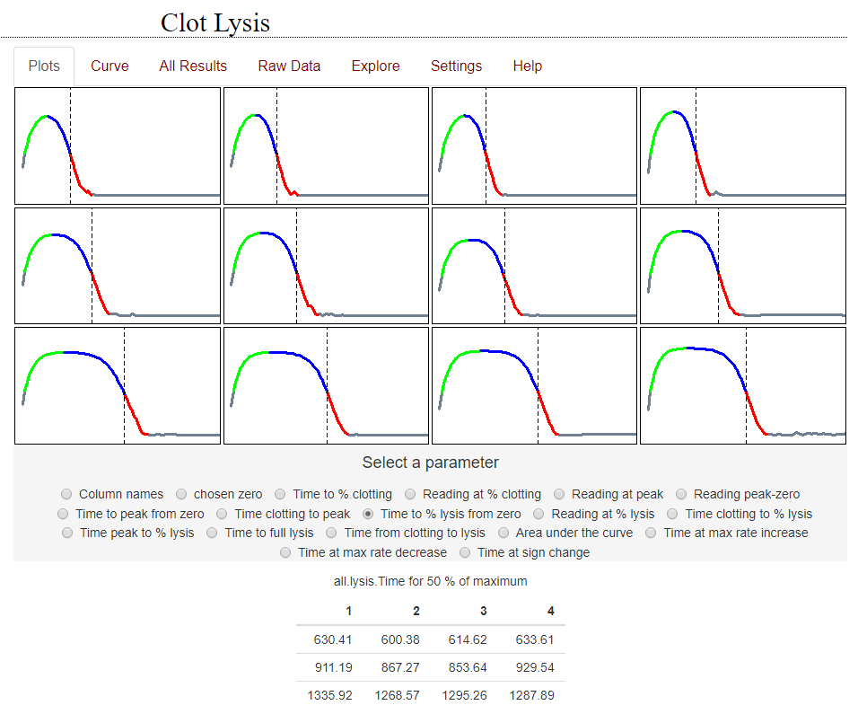

Options are provided for baseline selection and curve fitting to facilitate reproducible, high throughput analysis

This is a link to the online app, please try it out <A HREF = "https://drclongstaff.shinyapps.io/clotlysisCL_2019" TARGET="_blank">ClotlysisCL_2019</A>

Detailed help notes are available <A HREF = "./docs/Clotlysis-CL-help-notes-2019.pdf" TARGET="_blank">here</A>

There is an updated simplified app available to analyse clot lysis curves. There are fewer options for manipulating the curves but the app can handle awkward data better, including empty wells or noisy responses. 

Please try it out: <A HREF = "https://drclongstaff.shinyapps.io/Simple_clotlysis_app" TARGET="_blank">Simple_Clotlysis</A>

Return to <a href="#top">top</a>

	
### Clotting curves or fibrinolysis halo assays

Absorbance curves from assays where fibrinogen or plasma is clotted in microtitre plates are analysed using this app.  The app is a modified version of the Clotlysis app, without the lysis phase.  Fibrinolysis can also be explored using halo assays, which were recently developed as an optical method that uses whole blood to measure fibrin clot breakdown.  A 'halo' blood clot is formed around the edge of a microtitre plate well and a thrombolytic enzyme is added in solution to the well.  In both clotting and halo methods, an increasing absorbance is observed to a maximum and the time to 50% change can be conveniently used to measure enzyme activity on the chosen substrate.  Other options may also be selected.

 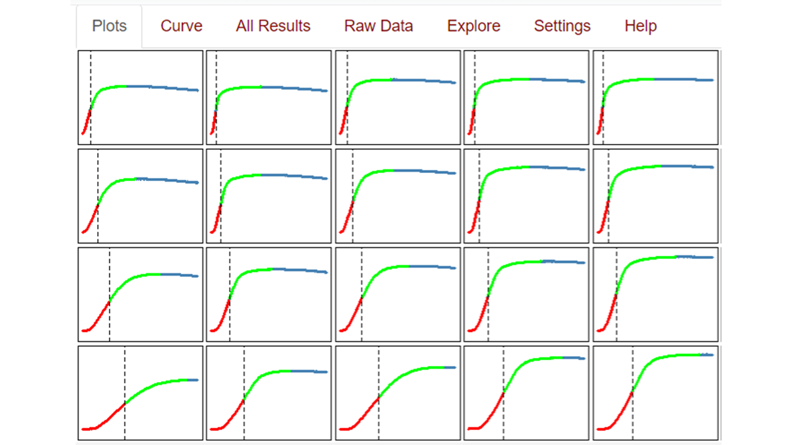
	
<A HREF = "https://drclongstaff.shinyapps.io/Clot_or_HaloCL" TARGET="_blank">Online app is here</A>

Detailed help notes are available <A HREF = "./docs/Clot_or_HaloCL-help-notes-2019.pdf" TARGET="_blank">here</A>

There is an updated simplified app available to analyse clotting curves. There are fewer options for manipulating the curves but the app can handle awkward data better, including empty wells or noisy responses. 

Please try it out: <A HREF = "https://drclongstaff.shinyapps.io/Simple_clotting_app" TARGET="_blank">Simple_clotting</A>

Return to <a href="#top">top</a>

### Simple Euglobulin Clot Lysis Time

This is the simplest clotting or lysis app covering only one page and with minimal options for curve adjustments. Results are reported for lysis times at the nearest time point to 50% lysis, without any interpolation between points. It may be suitable for noisy data such as found in Euglobulin Clot Lysis Time (ECLT) curves because wells can be removed from analysis if they cause problems or do not give sensible results. The app has also been simplified because it is written using Shinylive, meaning it is not hosted on a server but runs entirely in the user's browser. This may result in a short delay as the app loads at startup.

 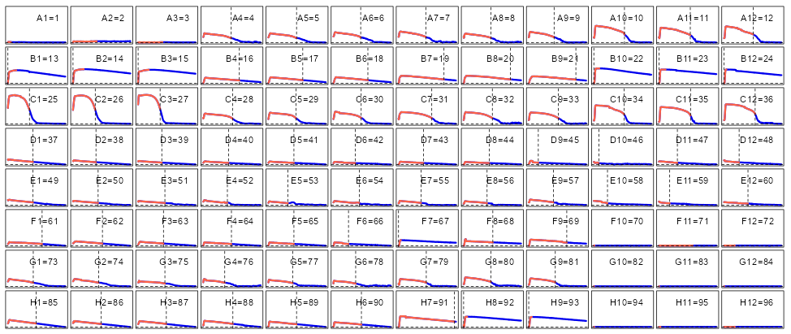
 
 <A HREF = "https://drclongstaff.github.io/ECLT_CL" TARGET="_blank">Online app is here</A>

Detailed help notes are available <A HREF = "./docs/ECLT-app-notes.pdf" TARGET="_blank">here</A>

Return to <a href="#top">top</a>

	

### Zymogen activation, for example plasminogen activation assays

Clotting and fibrinolysis cascades involve zymogen activation reactions, which are often studied in isolation.  For example reaction mixtures of enzyme (e.g. streptokinase), substrate (e.g. plasminogen) and chromogenic substrate that is sensitive to the generated plasmin.  The rate of plasmin generation (in other words the activity of streptokinase) can be derived from plots of chromogenic substrate hydroloysis versus time squared.  This app makes these calculations easy to perform.

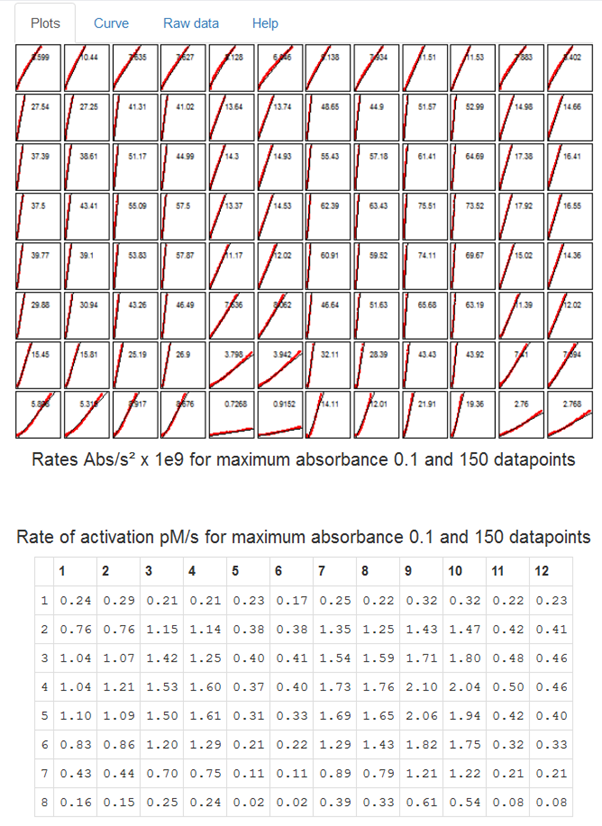
	
The app can be used to calculate rates of simple chromogenic substrate hydrolysis, rates of absorbance versus time squared, or by providing a few parameters, the rate of zymogen activation in pM/s

<A HREF = "https://drclongstaff.shinyapps.io/zymogenactnCL" TARGET="_blank">Online app is here</A>

Detailed help notes are available <A HREF = "./docs/ZymogenActn06_help_notes.pdf" TARGET="_blank">here</A>

Return to <a href="#top">top</a>

	
### Thrombin generation

This app is similar to the clot lysis app but raw fluorescence data and calibrator data are loaded and the app performs the necessary calculations to generate thrombin generation curves with or without corrections for substrate depletion and inner filter effect, or thrombin-alpha-2-macroglobulin contribution.

 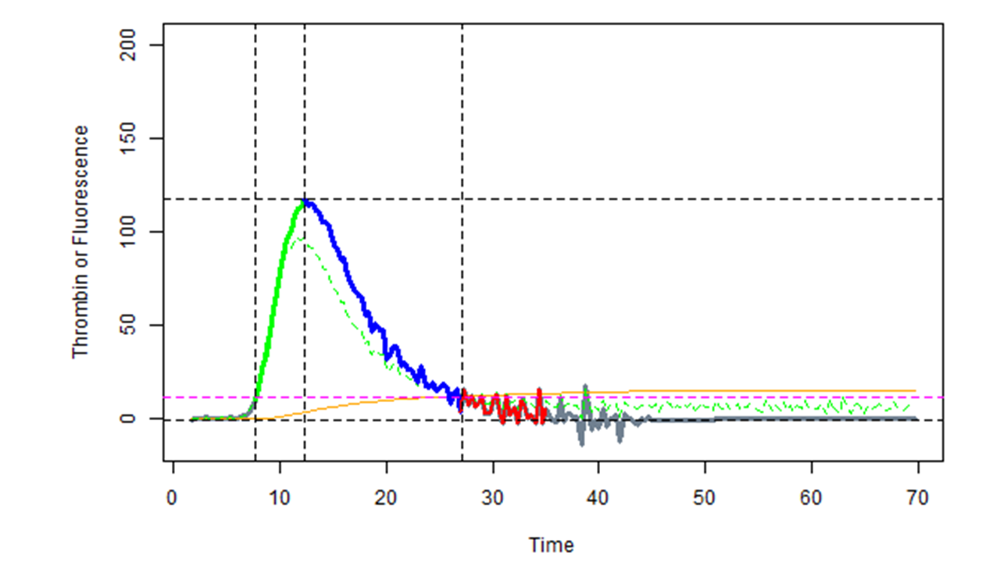
	
<A HREF = "https://drclongstaff.shinyapps.io/ThrombinCL" TARGET="_blank">Online app is here</A>

Detailed help notes are available <A HREF = "./docs/TGA_help_notes_2020.pdf" TARGET="_blank">here</A>

Return to <a href="#top">top</a>

	

### Screening tests and false positives, for example with D-dimer assays

This app was designed to help understand how sensitivity, specificity and prevalence affect rates of true/false positive and negative results in screening tests.  It uses some published numbers from D-dimer testing, but is useful for all kinds of screening tests.  The <i> Notes </i> tab covers some other possible applications.

 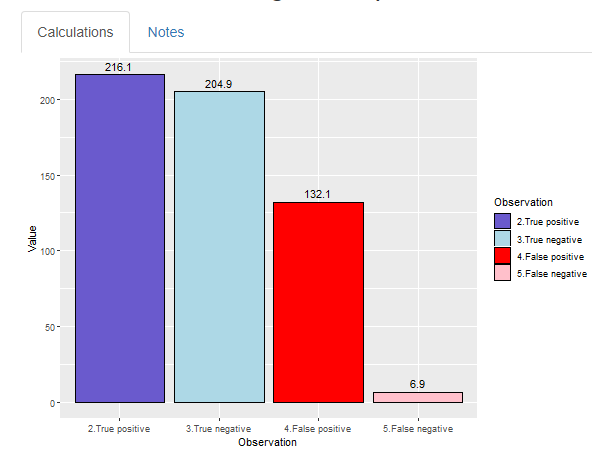
	
<A HREF = "https://drclongstaff.shinyapps.io/ScreeningCL" TARGET="_blank">Online app is here</A>

There is a related app that deals with Covid-19 testing and includes additional notes and results from population studies on antibody testing.

<A HREF = "https://drclongstaff.shinyapps.io/Covid_19_testsCL" TARGET="_blank">Covid app is here</A>

Return to <a href="#top">top</a>

	

### Michaelis Menten kinetics and linear transformations

This app analyses Michaelis Menten curves by non-linear regression and compares results for various common linear transformations (Lineweaver-Burk, Eadie-Hofstee, etc).  The linear transformations are not recommended to derive Km and Vmax values but may be useful to identify non-standard kinetics.

 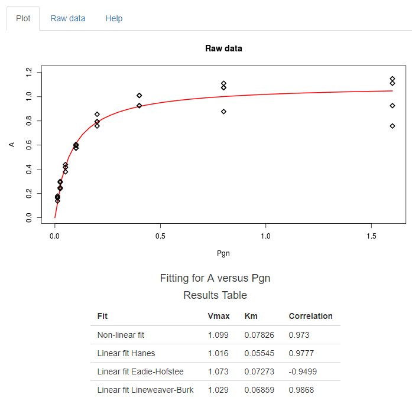

<A HREF = "https://drclongstaff.shinyapps.io/MichaelisMentenCL" TARGET="_blank">Online app is here</A>

Return to <a href="#top">top</a>

### Binding curves and Scatchard plots

This app is useful for analysing ligand binding isotherms and performing Scatchard transformations.  It also helps optimise experiments as the app will generate binding curves from supplied Kd values and concentration ranges.  There is an option to use total added ligand or free ligand to see what effect this has on the binding curve and derived values.  Sometimes non-standard binding behaviour is mis-identified because the experimentor plots bound and added ligand rather than bound and free ligand.

 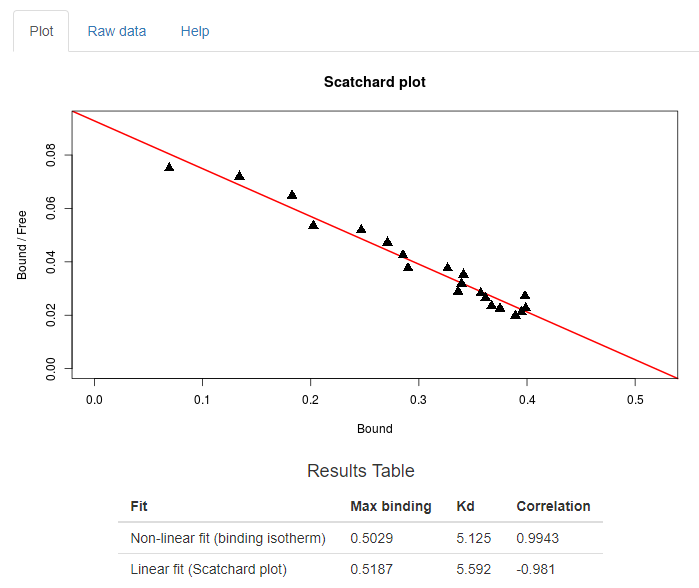

<A HREF = "https://drclongstaff.shinyapps.io/scatchardCL" TARGET="_blank">Online app is here</A>

Return to <a href="#top">top</a>

	
### Prekallikrein activator contamination in albumin or immunoglobulins

Prekallikrein activator (PKA) is a contaminant in therapeutic albumin solutions and can be measured in a zymogen activation assay where PKA acts on a substrate (PKS) to generate kallikrein, which hydrolyses a chromogenic substrate.  This app has more options that the zymogen activation app above because it allows the user to automatically subtract absorbance from wells without PKS from test wells with PKS.  This step removes the contribution of pre-existing kallikrein, which is not of interest.

This is how the plate looks with background subtraction from the top half of the plate

 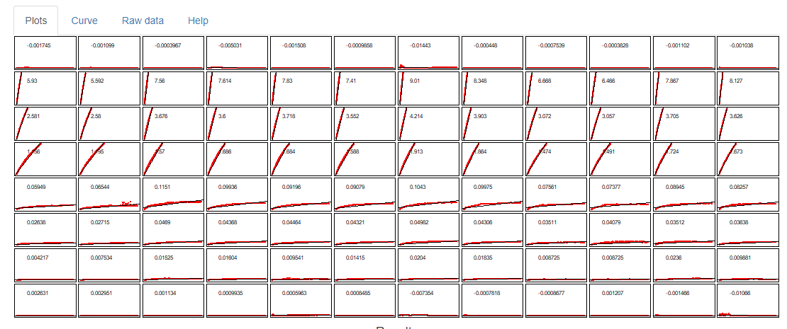

<A HREF = "https://drclongstaff.shinyapps.io/PKA_CL" TARGET="_blank">Online app is here</A>

Detailed help notes are available <A HREF = "./docs/PKA_assay_help_notes.pdf" TARGET="_blank">here</A>

Return to <a href="#top">top</a>

	
### Covid screening tests

This app is adapted from the screening app described above but contains some data from the work on Covid-19 screening studies.  The problem of test accuracy and disease prevalance is highlighted again.  Screening studies are often performed to find the prevalence of Covid-19 using PCR or antigen tests, or to find the numbers of people previously infected using antibody tests.  However, some idea of prevalence, as well as test sensitivity and specificity, are needed in order to interpret test results. How these factors affect false negative and false positive results can be explored using this app.

 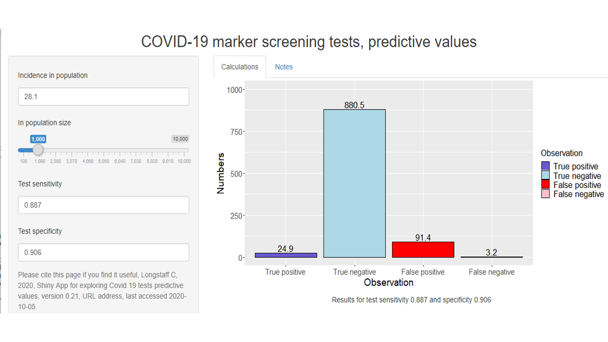

<A HREF = "https://drclongstaff.shinyapps.io/Covid_19_testsCL/" TARGET="_blank">Online app is here</A>

	
### Covid comparing deaths and cases in the UK and other countries

This app uses data from Our World in Data and opens with UK daily and cumulative deaths. The same results for a second country, selected from the dropdown menu, are overlaid on the UK data. The second country can be filtered by continent. Tabs are also available to show the latest results for daily cases and daily deaths.  Column charts are generated for best and worst overall deaths, or daily cases, for the selected continent in the appropriate tabs. 

 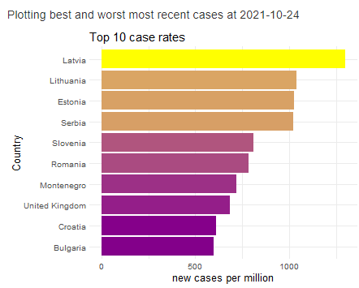

<A HREF = "https://drclongstaff.shinyapps.io/Covid_UK/" TARGET="_blank">Online app is here</A>
Return to <a href="#top">top</a>

