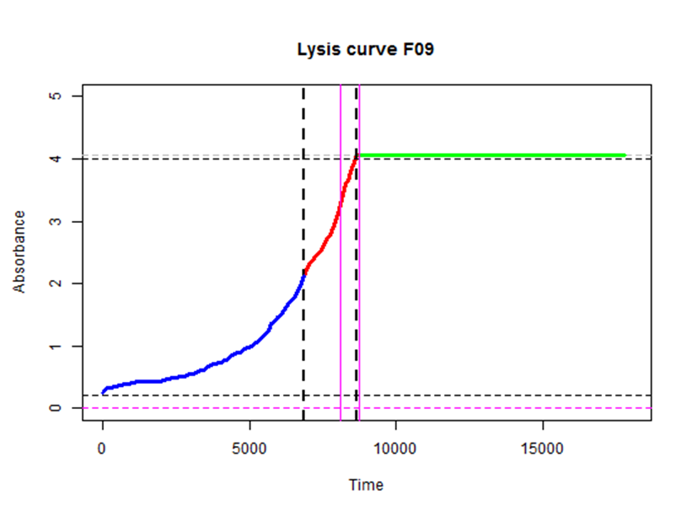

## Welcome to my GitHub Pages  

### This site contains links to my Shiny apps that deal with biochemical analysis, particularly in relation to haemostasis and the clotting and lysis of fibrin.

#### Choose a brief description or follow the online link

<table>
	<tr> 
	<th>Brief description below</th> 
	<th>Link to online app</th> 
	</tr> 
	<tr> <td><a href="#lysis">Clot lysis</a></td> 
		<td>
			<A HREF = "https://drclongstaff.shinyapps.io/clotlysisCL_2019" TARGET="_blank">ClotlysisCL_2019</A>
		</td> 
	</tr> 
	<tr> <td><a href="#generation">Thrombin generation</a></td> 
		<td>
			<A HREF = "https://drclongstaff.shinyapps.io/ThrombinCL" TARGET="_blank">ThrombinCL</A>
		</td> 
	</tr>  
	 <tr> <td><a href="#tests">Screening tests</a></td> 
		<td>
			<A HREF = "https://drclongstaff.shinyapps.io/ScreeningCL" TARGET="_blank">ScreeningCL</A>
		</td> 
	</tr> 
	<tr> <td><a href="#activation">Zymogen activation</a></td> 
		<td>
		<A HREF = "https://drclongstaff.shinyapps.io/zymogenCL" TARGET="_blank">ZymogenCL</A>
		</td> 
	</tr> 
	<tr> <td><a href="#kinetics">Michaelis Menten kinetics</a></td> 
		<td>
			<A HREF = "https://drclongstaff.shinyapps.io/MichaelisMentenCL" TARGET="_blank">MichaelisMentenCL</A>
		</td> 
	</tr> 
	<tr> <td><a href="#plots">Scatchard plots</a></td> 
		<td>
		<A HREF = "https://drclongstaff.shinyapps.io/scatchardCL" TARGET="_blank">ScatchardCL</A>
		</td> 
	</tr> 
	<tr> <td><a href="#analysis">Fibrinolysis halo assays</a></td> 
		<td>
			<A HREF = "https://drclongstaff.shinyapps.io/HalolysisCL" TARGET="_blank">HalolysisCL</A>
		</td> 
	</tr> 
	<tr> <td><a href="#albumin">Prekallikrein in albumin</a></td> 
		<td>
		<A HREF = "https://drclongstaff.shinyapps.io/PKA_CL" TARGET="_blank">PKA_CL</A>
		</td> 
	</tr> 
</table>

### Clot lysis

The first Shiny app I developed was designed to facilitate the analysis of fibrin clotting and lysis curves, such as the one shown below. 

 

The output from a set of clot lysis curves is shown here, along with the results for the time to 50% clot lysis. The app makes it easy to extract selected parameters from these curves, such as time to a chosen % lysis, maximum absorbance, area under the curve, etc.

Options are provided for baseline selection and curve fitting to facilitate reproducible, high throughput analysis

This is a link to the online app, please try it out [clotlysis_2019](https://drclongstaff.shinyapps.io/clotlysisCL_2019)

Detailed help notes are also available [here](./docs/Clotlysis_CL_help_notes_2019.pdf){:target="_blank"}

	
### Thrombin generation

 

Detailed help notes are available [here](./docs/TGA_help_notes_2019.pdf){:target="_blank"}

	
### Screening tests and false positives, for example with D-dimer assays

 

	
### Zymogen activation, for example plasminogen activation assays

	
Detailed help notes are available [here](./docs/ZymogenActn06_help_notes.pdf){:target="_blank"}

	
### Michaelis Menten kinetics and linear transformations

	
### Binding curves and Scatchard plots

	
### Fibrinolysis halo assays

 

	
### Prekallikrein activator contamination in albumin or immunoglobulins

This is how the plate looks with background subtraction from the top half of the plate

 
	
Detailed help notes are available [here](./docs/PKA_assay_help_notes.pdf){:target="_blank"}
